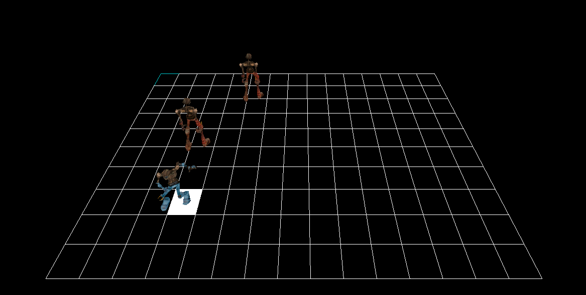
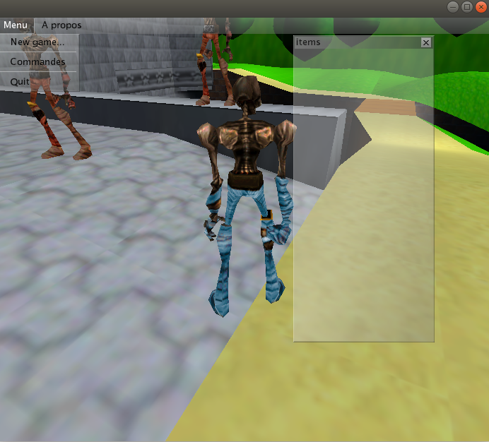

# Projet_fin_d_annee


December 14, 2018   ->    January 25, 2019


</br>

### Nom du projet:

Projet de majeure Image, modélisation et informatique (IMI) à [CPE Lyon](https://www.cpe.fr/ingenieur-sciences-du-numerique/majeure-image-modelisation-informatique/).

</br>

### Auteurs:

* Pedro FOLETTO PIMENTA
* Cédric KUASSIVI
* Dylan TOSTI


</br>

### Description du projet:

#### Contexte:
Le projet de majeure est inscrit dans la formation d'ingénieur à CPE Lyon, et sa validation joue un rôle important dans l'obtention du diplôme d'ingénieur en sciences du numérique. Ce projet s'étend sur 100 heures durant le mois de Janvier.

Le projet s'effectue par groupe de 2 ou 3 personnes toutes spécialisées dans le même domaine (dans notre cas: Image, modélisation et informatique).

Il s'agit lors du projet de réaliser une application en rapport avec notre spécialité et qui applique directement ou indirectement une (ou plusieurs) thématiques abordée(s) tout au long de notre spécialisation et de notre formation d'ingénieur. Ainsi, notre application doit s’inscrire dans les thématiques: de l’acquisition, du traitement ou de l’analyse et la manipulation de données numériques dont l’application principale concerne les domaines de l’analyse et de la synthèse d’images.


#### Présentation du projet:
Le projet est codé en c++, et utilise le moteur de jeu iirlicht.

Il s'agit d'un jeu vidéo de type combat, dont les ennemis sont des IA.

Le joueur se déplace dans un environnement en 3D. Lorsqu'il entre dans le champ d'attaque d'un ennemi, le jeu est basculé dans une scène 2D. Le joueur n'a pas la possibilité de fuir lorsque le combat est engagé. Le jeu est de nouveau basculé dans la scène 3D lorsque tous les ennemis sont vaincus.

Lorsque le combat est engagé, à tour de rôle, le joueur puis les ennemis réalisent des actions (attaquer, se soigner, se déplacer). Les actions des ennemis seront prédites par reinforcement learning.


</br>

### Etat du projet:

En cours de développement ...


</br>

### Documentation:

#### Compilation et exécution du code:

  _Remarque : Si vous souhaitez compiler le code juste pour le tester, il est conseillé d'utiliser la méthode 2 (utilisation du makefile fourni).
  Si vous souhaitez modifier le code et tester les modifications, il est conseillé d'utiliser Qt pour lancer le CMakeLists.txt fourni (méthode 1.2)._

  _Il est également possible de passer en argument lors de l'exécution du code la chîne de caractère "train" ( `$ ./projetFA train` ) ce qui a pour effet d'entraîner les ennemis et de générer un nouveau fichier test__table.txt qui servira de LUT pour la gestion du choix des actions de l'ennemi en fonction de son état._


1. Avec le CMakeLists.txt :
  * Possibilité 1 (**non recommandée**): Se placer dans le répertoire ./projet/ (où se touve le fichier CMakeLists.txt) puis exécuter les commandes suivantes dans un terminal :
  ```
  $ cmake . #pour generer le makefile dans le meme repertoire
  $ make #afin de compiler le code
  ```
  Copier ensuite le dossier data/ présent à la racine du projet (présent dans le même répertoire que les dossiers src/ et lib/) dans le répertoire ou a été créé le fichier exécutable `projetFA` a l'issue de la compilation.

  Pour exécuter le code, lancer la commande :
  ```
  $ ./projetFA
  ```
  Dans un terminal.

  * Possibilité 2 (**recommandée** pour modifier le code et tester les modifications): Lancer le CMakeLists.txt avec QTcreator et compiler et exécuter le code avec Qt.

    _Penser à copier le dossier data/ présent à la racine du projet (présent dans le même répertoire que les dossiers src/ et lib/) dans le répertoire build créé au lancement de Qt._


2. Avec le makefile (**recommandée** pour une simple exécution):

  Il suffit de se placer dans le répertoire ./projet/code_projet/ puis exécuter la commande :

  ```
  $ make #afin de compiler le code
  ```

  Pour compiler le code puis la commande :
  ```
  $ ./projetFA
  ```
  Pour lancer l'application.


#### Comment jouer (touches à appuyer pour les actions):

##### Mode Combat :
<div style="text-align:center"></div>
</br>

* **Clavier** :

  **Z** ⇒ déplacement vers le haut
  </br>
  **Q** ⇒ déplacement vers la gauche
  </br>
  **S** ⇒ déplacement vers le bas
  </br>
  **D** ⇒ déplacement vers la droite
  </br>
  **SPACE** ⇒ choisir d'attaquer
  </br>
  **A** ⇒ Reset : retour à la position réelle du joueur et annulation des choix à effectuer avant de passer la main à l'ennemi.
  </br>
  **M** ⇒ Valider l'action du joueur (valider le déplacement ou l'attaque du joueur) et passer la main à l'ennemi.


* **souris** :

  **Clic gauche maintenu et souris déplacée** => rotation de la caméra
  </br>
  **Molette** => Zoom et dezoom
  </br>
  **Clic droit** => Caméra à sa position de départ.


</br> </br>

##### Mode Jeu libre :

<div style="text-align:center"></div>
</br>

* **Clavier** :

  **Z** ⇒ déplacement vers l’avant
  </br>
  **Q** ⇒ rotation vers la gauche (optionnelle car possibilité de tourner avec la souris)
  </br>
  **S** ⇒ déplacement vers l’arrière
  </br>
  **D** ⇒ rotation vers la droite (optionnelle car possibilité de tourner avec la souris)
  </br>
  **I** ⇒ Afficher ou cacher la fenêtre des items.
  </br>
  **A** ⇒ A chaque appui sur la touche A, la vitesse du personnage est modifiée : Elle peut valoir :  3, 6, 9, 12, 15 ou 18. Par défaut, la vitesse (speed) vaut 3.
  </br>
  **SPACE** ⇒ saut du personnage

* **souris** :

  **Clic gauche maintenu et souris déplacée** => rotation de la caméra (il n’est malheureusement pas possible de regarder en haut ou en bas).

</br> </br>

#### Rapport de bugs:

Bugs non fixés à résoudre, etc... (A compléter ...)
