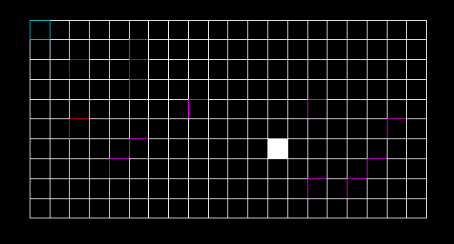

# Objectifs:

  

### Objectif 1: Avoir un jeu vidéo fonctionnel (sans gestion de l’ennemi)

#### Etape 1: Maps (3d et grid) fixes
- [x] Map 2D fixe (création d'une grille de dimensions fixées)

- [ ] Map 3D fixe (import de la map 3D dans laquelle évoluera le joueur)

#### Etape 2: Déplacement dans la scène 3D et dans la grid
- [x] Déplacements du joueur et des ennemis dans la grid (2D)
- [ ] Animations des déplacements dans la grid (animations 3D)
- [ ] Déplacements du joueur dans la scène 3D

#### Etape 3: gestion du combat
- [ ] Basculement de la scène 3D à la scène mappée (2D) et inversement
- [ ] Possibilité du joueur d'attaquer
- [ ] Possibilité du joueur de recevoir des dégâts
- [ ] Gestion du tour à tour

  

### Objectif 2: Gestion de l’ennemi

#### Etape 1: Q-table
- [x] Codage de la Q_table (avec N (= 5) actions et M états)
- [ ] Entraînement de la Q_table

#### Etape 2: Animations
- [ ] Animations 3D des enemis en fonction des actions choisies

#### Etape 3: Action en combat
- [ ] Application en temps de la Q_table entraînée aux enemis afin de leur faire choisir les actions adaptées à la situation

  

### Objectif 3 : Extras

#### Etape 1 : IA deep

#### Etape 2 : Combat plus complexe

#### Etape 3 : Terrain procédurale
